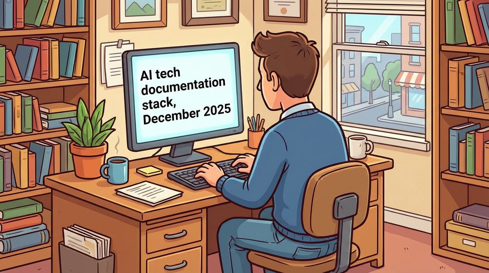

# AI Tech Doc Stack (December 2025)

The purpose of this repository is to bundle together a resource list containing tools I have developed or used during the course of 2025 to support the generation and creation of technical documentation.

The overarching goal is to leverage the most promising generative AI tools and existing utilities while still allowing the technical writer to remain in firm control of the authorship process.

The stack is by no means exhaustive, nor will it suit everybody, but it should contain a good starting point for someone wishing to explore how to leverage generative AI in the process of tech doc creation.

## Documentation

- **[AI Tech Doc Stack (PDF)](ai-tech-doc-stack.pdf)** - Complete formatted guide
- **[AI Tech Doc Stack (Markdown)](ai-tech-doc-stack.md)** - Plain text version

## Stack Components

| Component | Primary Tool | Purpose |
|-----------|--------------|---------|
| Voice Transcription | Gemini Flash (multimodal) | Fast, formatted note capture |
| Diagram Generation | Nano Banana Pro | Technical diagrams with accurate text |
| Document Compilation | Typst | Programmatic PDF generation |
| Workflow Orchestration | Claude Code | Agentic document iteration and management |

## Recommended APIs

- [Replicate](https://replicate.com) - Run ML models via API
- [Fal](https://fal.ai) - Fast inference for generative models
- [OpenRouter](https://openrouter.ai) - Unified API for LLMs

## Recommended MCP Servers

- [Replicate MCP](https://mcp.replicate.com)
- [Gemini Transcription MCP](https://github.com/danielrosehill/Gemini-Transcription-MCP)
- [Typst MCP](https://github.com/johannesbrandenburger/typst-mcp)
- [Mermaid Chart MCP](https://docs.mermaidchart.com/ai/mcp-server)

## Examples

See the [examples/](examples/) folder for sample outputs.

## Notes

My workflows are highly biased towards using Markdown as a lightweight format, at least for initial drafting. Tools for writing in Markdown are outside the scope of this project (I use VS Code, but Typora is nice too!).

---

**Author:** Daniel Rosehill
**Website:** [danielrosehill.com](https://danielrosehill.com)
**Business:** [DSR Holdings](https://dsrholdings.cloud)
