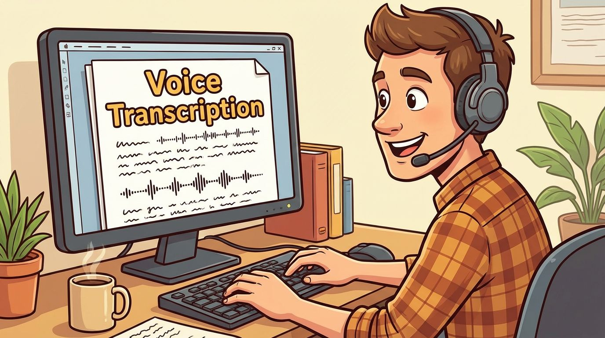
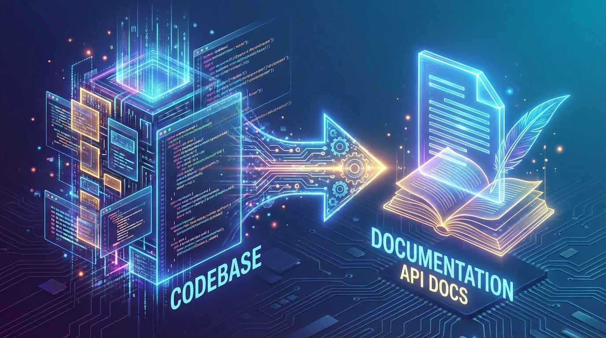
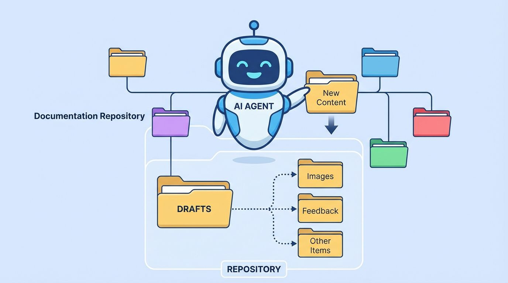

# AI-Assisted Technical Documentation Stack

## Overview

This document outlines the components of a modern AI-assisted technical documentation workflow, combining the most promising generative AI tools with existing utilities while allowing the technical writer to remain in firm control of the authorship process.

As a general note, these workflows are highly biased towards using Markdown as a lightweight format, at least for initial drafting. The stack is not exhaustive, nor will it suit everybody, but it provides a solid starting point for leveraging generative AI in technical documentation creation.

---

## Voice Transcription (ASR & Multimodal Models)

During the course of 2025, I have come to really embrace all manner of voice technology as an effective mechanism for quickly capturing notes and especially documenting procedures, as is commonly required in technical documentation.

Fully exploring the different components of effective dictation is beyond the remit of this document. Human factors include pronunciation, and hardware considerations include the selection of a suitable microphone.

Where AI has greatly facilitated this workflow is in the availability of highly accurate and affordable speech-to-text software through ASR models.

My personal recommendation, however, is to use an audio multimodal model. I currently use *Gemini Flash* for the majority of my dictation needs, as opposed to using *Whisper*. I do this because it allows me to combine all manner of specific instructions for formatting and style, and to provide all of these in a single output, with the audio and text as the combined input.

### Recommended Tools & Configuration

I've been using Gemini Flash as my transcription driver for the past couple of months.

Google maintains an API endpoint called `gemini-flash-latest` which dynamically maps onto the latest Flash model. This is extremely helpful when models are updated frequently and you want your transcription apps to keep pace without needing to frequently update environment variables.

The specific transcription workflow is audio-text to text (this is the Hugging Face task label). Audio and text are the inputs, and formatted transcribed text is the output. This involves billing for audio tokens (as input) and text (as both input and output).

Using multimodal ASR for transcription has proven to be an extremely cost-effective model. It offers significant value over using traditional ASR, in that instead of having to use two tools for formatted transcription, you can reduce this to one.

In budget-constrained environments, it's possible to use the Lite endpoints (like `gemini-flash-25-lite`), but I haven't found it necessary. I completed almost 1,000 short transcriptions using OpenRouter for less than $2 (no prompt caching!).

Gemini models can be accessed both through Google's API directly (Gemini and Vertex AI) and also through OpenRouter, which now supports audio input as a modality.

For tooling, I've created a [Voice Notepad desktop application](https://github.com/danielrosehill/AI-Transcription-Notepad) specifically for this purpose. Commercial tooling also exists.

---

## Generative AI for Diagrams & Visuals

Generating technical documentation frequently involves creating diagrams to explain concepts and workflows through visual means.

The utility of generative AI tools in this regard, in my experience at least, has long been severely hampered by the problem of pseudotext - and specifically the tendency of models to introduce typos by inaccurately representing labels. This is a dealbreaker in technical documentation workflows where precise labeling is essential.

The first model I have seen that has reached a point of relative stability in this regard is Nano Banana Pro from Google. However, even Nano Banana Pro isn't perfect and sometimes does generate pseudotext.

There are a few ways to work around this:

- The first is to generate flowchart documentation that leverages the ability of generative AI tools to create interesting images and then add the text afterward.
- You can remediate pseudotext retrospectively, but this seems like a poor approach.

However, there is room for optimism.

Nano Banana Pro has almost closed the gap between requirement and delivery such that I expect that during 2026, generative AI tools that can reliably generate highly specific technical diagrams will be widely available.

The significance of what these tools offer for diagram generation is also, in my opinion, extremely significant. While tools like Mermaid are great for generating flowcharts, sometimes that format feels a little stagnant and boring. Generative AI allows technical documentation writers to be much more imaginative in how they visually communicate the information to readers.

### Recommended Tools & Platforms

Nano Banana Pro is the first, and so far only, tool that I have found that can reliably generate tech documentation without introducing significant pseudotext.

Despite the relatively advanced nature of generative AI models in late 2025, the problem of pseudotext remains remarkably stubborn. Even models that offer cutting-edge image-to-image capabilities struggle enormously when it comes to either generating text, adhering to instructions, or editing an existing diagram without introducing pseudotext in the process.

I expect that in 2026, we may see more models that meet this standard, as well as fine-tunes of image models that are specifically marketed for the tech writing community user base, which to date has been extremely neglected in the generative AI world.

Using generative AI to create or edit tech documentation allows one to create stylistic and creative versions of documentation, providing much more creative ground to explore than traditional flowcharts.

The choice is also not binary: flowcharts generated using traditional tech diagram software can be enhanced with backgrounds or other elements (like icons) from generative AI tools.

For using generative AI for this purpose, I recommend **Replicate** and **Fal** as ways to get access to many different models. Their platforms are also particularly valuable for running informal evaluations to assess the capabilities of different models to generate sufficiently accurate tech diagrams.

---

## Programmatic Document Generators

I have always wanted to learn LaTeX, but I have never worked in an environment where strict representations of things like mathematical formulae were an operational requirement.

However, tools to programmatically compile documents remain extremely useful and important.

**Typst** offers a beautiful compiling format, allowing the user to define a style guide through font, color, and other elements, and to render it into a PDF for distribution.

### Tooling

Typst MCP provides an easy way to use Typst (or Claude Code can use it directly).

- [Typst MCP Server](https://github.com/johannesbrandenburger/typst-mcp)

---

## Agentic AI & Git-Based Workflows

I began using Git and GitHub in a previous job where I needed to learn it in order to update a company website. I was taught Git by software developers (this is not to suggest that my own usage of Git adheres to those standards!)

Over time, I have come to really embrace the repository as a mechanism for version control. I believe there is no good reason why Git needs to only be used for code generation. I have sometimes even used a GitHub repository to work on purely documentation-oriented papers, such as a white paper.

Although that approach might have seemed very strange a few years ago, in the era of agentic AI, it has come to be incredibly practical.

Using Claude Code, I can leverage the help of AI in a very specific way. I can define a folder for drafts and ask Claude to proofread my first draft, then use a sub-agent whose instruction is to iterate the draft numbers, and finally, run my drafts through Typst in order to generate the PDFs.

This allows me to leverage generative AI tools in a way that ensures my tone of voice remains consistent in the documents while using AI for all the more administrative parts of generating and iterating upon technical documentation that do not add as much value.

### Agentic AI Tool Selection

Documentation generation and editing is not the most demanding use of AI tools and is arguably far closer to their original purposes as language models than code generation is.

However, especially when working across multiple drafts, demands for context can still be significant and easily exceed the capabilities of locally run models.

In daily practice, I use **Claude Code** as my workhorse for its excellent tool calling abilities, context window, and strong reasoning powers. Opus is particularly useful, but Sonnet can also do the trick.

The agentic AI tool can act as a glue that facilitates the aspects of your workflow that can be speed bumps, like going from first draft to iterations, compiling footnotes, and generating finished documents in presentable formats.

---

## Summary

This stack combines:

| Component | Primary Tool | Purpose |
|-----------|--------------|---------|
| Voice Transcription | Gemini Flash (multimodal) | Fast, formatted note capture |
| Diagram Generation | Nano Banana Pro | Technical diagrams with accurate text |
| Document Compilation | Typst | Programmatic PDF generation |
| Workflow Orchestration | Claude Code | Agentic document iteration and management |

The overarching goal is to leverage the most promising generative AI tools and existing utilities while still allowing the technical writer to remain in firm control of the authorship process.
